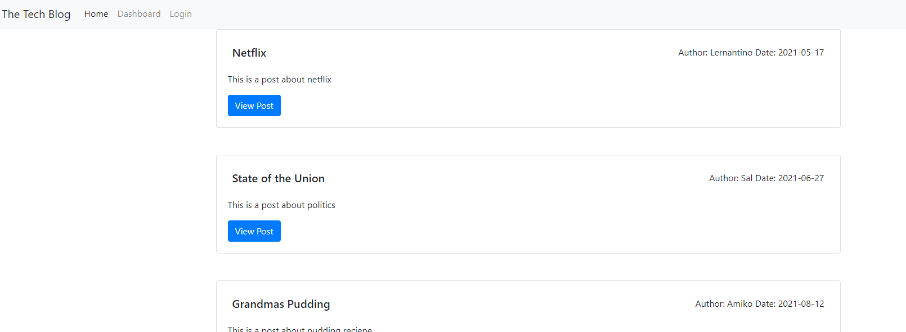
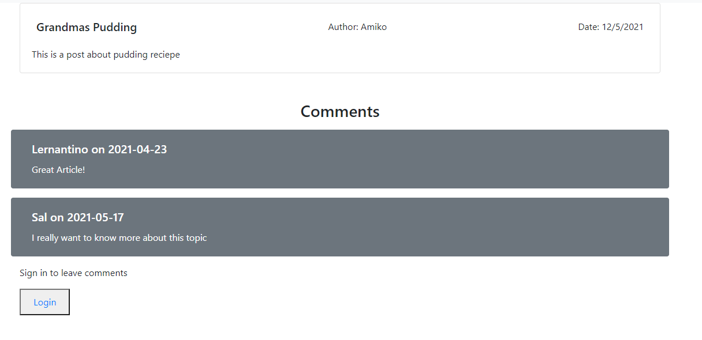
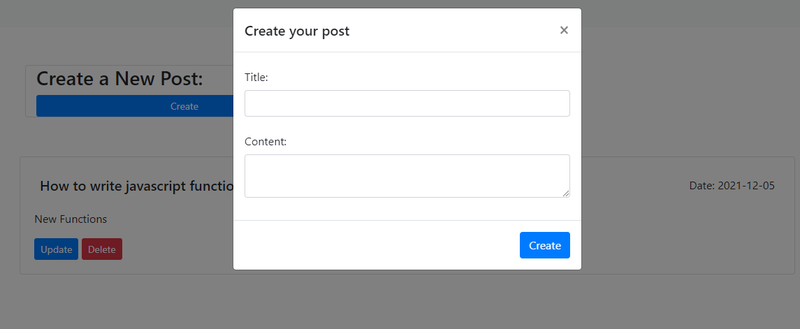

# TECH BLOG

[](https://github.com/msp4msps)
[](https://github.com/msp4msps/tech_blog)
[](https://github.com/msp4msps/tech_blog)
[](https://choosealicense.com/licenses/mit/)

## Table of Content

- [ Project Links ](#Project-Links)
- [ Screenshots](#Screenshots)
- [ Project Description ](#Project-Description)
- [ User Story ](#User-Story)
- [ Technologies ](#Technologies)
- [ Installation ](#Installation)
- [ Usage ](#Usage)
- [ Credits and Reference ](#Credits-and-Reference)
- [ Tests ](#Tests)
- [ Contributing ](#Contributing)
- [ Questions ](#Questions)
- [ License ](#License)

#

## Project Links

https://github.com/msp4msps/tech_blog<br>
https://tech-blog2232432.herokuapp.com/

## Screenshots-Demo

<kbd></kbd><kbd></kbd><kbd></kbd><kbd></kbd>

## Project Description

This project was created to create a CMS-style blog site similar to a Wordpress site, where developers can publish their blog posts and comment on other developers’ posts as well.

## User Story

AS A developer who writes about tech, I WANT a CMS-style blog site SO THAT I can publish articles, blog posts, and my thoughts and opinions

## Technologies

```
Nodejs,MySQL,Heroku,Express
```

## Installation

Visit the heroku site linked above

## Usage

1. Click login to create a new login where you can create you own blog post. 2. View all content on the homepage and click into post to see comments. If you are logged in you will be able to leave new comments on post as well.

## Credits and Reference

None

## Tests

Visit the heroku site link provided above

## Contributing

Open a pull request

## Questions

Contact the author with any questions!<br>
Github link: [msp4msps](https://github.com/msp4msps)<br>
Email: msp4msps@tminus365.com

## License

This project is [MIT](https://choosealicense.com/licenses/mit/) licensed.<br />
Copyright © 2021 [NICK ROSS](https://github.com/msp4msps)
